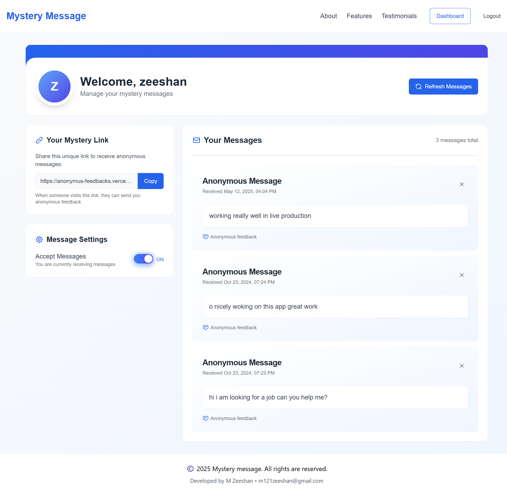

# Mystery Message - Anonymous Feedback Platform

[Live Demo](https://anonymus-feedbacks.vercel.app/)

Mystery Message is a modern anonymous feedback platform built with Next.js 14, allowing users to receive anonymous messages and feedback from their network. It features a clean, intuitive interface and robust security measures.


## Features

- **Anonymous Messaging**: Send and receive anonymous messages securely
- **User Authentication**: Secure email-based authentication system
- **Message Management**: Read, manage, and delete received messages
- **Message Toggle**: Control when to accept or pause incoming messages
- **Real-time Updates**: Instant message notifications and updates
- **Responsive Design**: Seamless experience across all devices
- **Email Verification**: Secure account verification process
- **Profile Sharing**: Easy-to-share profile links

## Technology Stack

- **Frontend**: Next.js 14, React, TypeScript, Tailwind CSS
- **Backend**: Next.js API Routes
- **Database**: MongoDB
- **Authentication**: NextAuth.js
- **Email Service**: Resend
- **UI Components**: Radix UI, Shadcn/ui
- **Styling**: Tailwind CSS with custom animations

## Screenshots

### Dashboard



## Getting Started

### Prerequisites

- Node.js 18.17 or later
- MongoDB database
- Resend API key for email services

### Environment Variables

Create a `.env` file in the root directory with the following variables:

```env
MONGODB_URI=your_mongodb_connection_string
NEXTAUTH_SECRET=your_nextauth_secret
NEXTAUTH_URL=http://localhost:3000
RESEND_API_KEY=your_resend_api_key
```

### Installation

1. Clone the repository:

```bash
git clone https://github.com/MZeeshanMalik/anonymus-feedbacks
cd mystery-message
```

2. Install dependencies:

```bash
npm install
```

3. Run the development server:

```bash
npm run dev
```

4. Open [http://localhost:3000](http://localhost:3000) in your browser.

## Project Structure

```
src/
├── app/                  # Next.js app directory
│   ├── (auth)/          # Authentication routes
│   ├── api/             # API routes
│   └── u/               # User profile routes
├── components/          # Reusable components
├── lib/                 # Utility functions
├── model/              # Database models
└── schemas/            # Validation schemas
```

## Core Features Implementation

### Anonymous Messaging

- Secure message submission without requiring sender authentication
- Custom message validation and sanitization
- Rate limiting to prevent spam

### User Dashboard

- Real-time message management
- Toggle for accepting/rejecting messages
- Message deletion functionality

### Security Features

- Email verification for new accounts
- Protected API routes
- XSS prevention
- Rate limiting on sensitive endpoints

## Deployment

The application is deployed on [Vercel/Your Platform](https://anonymus-feedbacks.vercel.app/). <!-- Add your deployment link -->

## Contributing

Contributions are welcome! Please feel free to submit a Pull Request.

## License

This project is licensed under the MIT License - see the [LICENSE](LICENSE) file for details.

## Contact

- Developer: M Zeeshan
- Email: m121zeeshan@gmail.com
- Project Link: [https://github.com/MZeeshanMalik/anonymus-feedbacks]

## Acknowledgments

- Next.js team for the amazing framework
- Vercel for hosting
- MongoDB for database services
- Resend for email services
